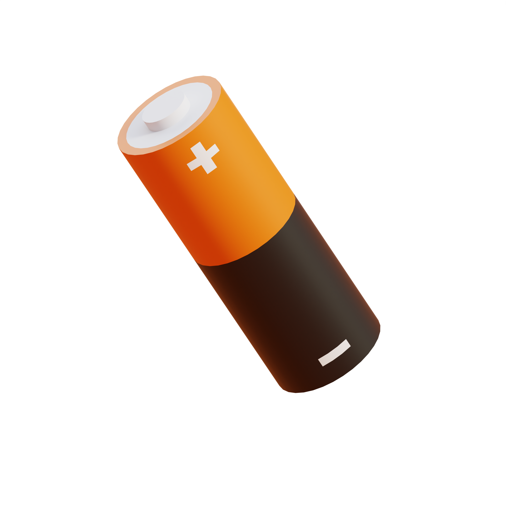
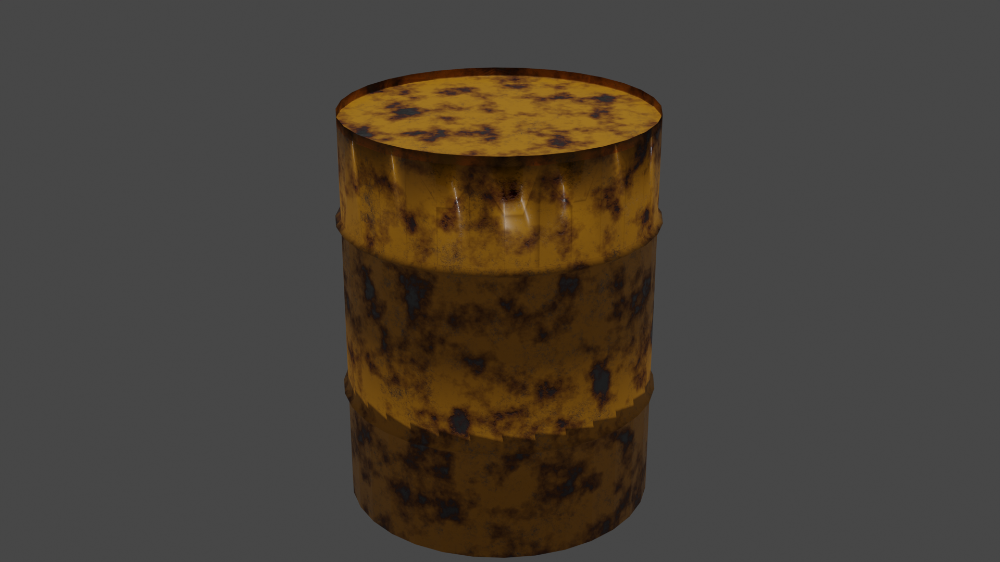
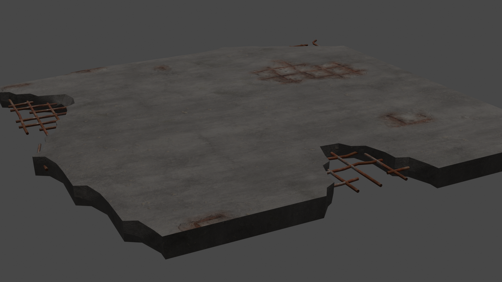
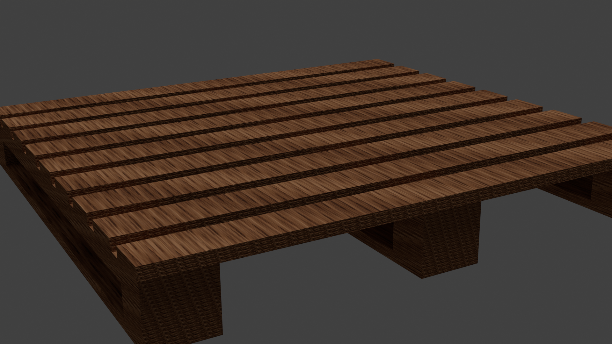

# 3D Model Assets for Blender

This repository contains `.blend` files for various 3D models.  
Preview thumbnails are shown below for quick reference.

| Model Name        | Preview                                | Description                      |
|-------------------|----------------------------------------|----------------------------------|
| Battery.blend     |          | Basic 3D battery model           |
| Drone.blend       |              | Simple drone/quadcopter model    |
| Gift.blend        |                | Wrapped gift box                 |
| Joystick.blend    |        | Video game joystick              |
| Laptop.blend      |            | Laptop computer                  |
| OilBarrel.blend   |     | Industrial oil barrel            |
| Rocket 2.blend    |           | Stylized rocket ship             |
| Rubics Cube.blend1|  | Rubik’s cube puzzle              |
| Shop.blend        |                | Shop/storefront                  |
| concrete slab.blend|  | Rectangular concrete slab    |
| wooden pallet.blend|  | Wooden pallet for logistics |

> *Thumbnails display at their natural resolution; for smaller icons, resize your images to about 100×100–200×200 px before uploading.*

## Usage

- Clone/download this repository.
- Open any `.blend` file in Blender (v2.8+).
- Use and modify assets as needed.
